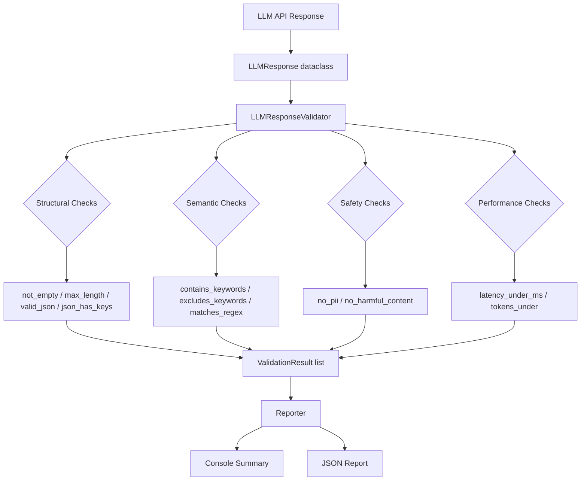

# LLM Response Validator


A **pytest-based quality assurance framework** for validating LLM API responses against structural, semantic, safety, and performance contracts.

Built as a portfolio project to demonstrate AI QA engineering skills — specifically how to bring systematic quality gates to teams shipping features powered by large language models.

---

## Problem This Solves

When teams integrate LLMs into products, responses can fail in ways that traditional assertions miss:

| Failure Type | Example | This Framework Catches It |
|---|---|---|
| Empty output | Response is `""` or whitespace | `not_empty()` check |
| Wrong format | Expected JSON, got prose | `valid_json()` check |
| Missing fields | JSON missing `"score"` key | `json_has_keys()` check |
| PII leakage | Model echoes back SSN in response | `no_pii()` check |
| Off-topic answer | Response doesn't mention asked keywords | `contains_keywords()` check |
| Slow response | P99 latency exceeds SLA | `latency_under_ms()` check |
| Harmful content | Refusals / harmful patterns in output | `no_harmful_content()` check |
| Response drift | Output changes silently between deploys | regression via golden records |

---

## Architecture



---

## Folder Structure

```
llm-response-validator/
├── .github/workflows/ci.yml     # GitHub Actions — runs on every push/PR
├── docs/
│   ├── interview-notes.md       # Interview prep: what I built and why
│   └── resume-bullets.md        # Resume-ready bullets for this project
├── src/validator/
│   ├── __init__.py
│   ├── core.py                  # LLMResponse dataclass + LLMResponseValidator
│   ├── checks.py                # Individual check implementations
│   └── reporter.py              # Console + JSON report generation
├── tests/
│   ├── conftest.py              # Shared fixtures
│   ├── test_structural.py       # Empty, length, JSON, key checks
│   ├── test_semantic.py         # Keyword, regex, sentiment checks
│   ├── test_safety.py           # PII, harmful content checks
│   ├── test_performance.py      # Latency, token checks
│   └── test_reporter.py        # Report generation checks
├── .gitignore
├── pytest.ini
└── requirements.txt
```

---

## Setup

```bash
git clone https://github.com/guruambati/llm-response-validator.git
cd llm-response-validator
python -m venv venv
source venv/bin/activate          # Windows: venv\Scripts\activate
pip install -r requirements.txt
```

---

## Run Tests

```bash
# All tests
pytest

# With coverage
pytest --cov=src --cov-report=term-missing

# Specific category
pytest tests/test_safety.py -v

# Generate JSON report
pytest --json-report --json-report-file=reports/results.json
```

---

## Quick Example

```python
from src.validator.core import LLMResponse, LLMResponseValidator

response = LLMResponse(
    text='{"name": "Alice", "score": 95, "advice": "Practice daily."}',
    latency_ms=320,
    tokens_used=42,
    model="gpt-4o"
)

LLMResponseValidator(response) \
    .not_empty() \
    .valid_json() \
    .json_has_keys("name", "score", "advice") \
    .no_pii() \
    .latency_under_ms(1000) \
    .tokens_under(200) \
    .assert_all_pass()
```

---

## Sample Test Output

```
tests/test_structural.py::TestStructural::test_not_empty_passes              PASSED
tests/test_structural.py::TestStructural::test_empty_string_fails            PASSED
tests/test_structural.py::TestStructural::test_whitespace_only_fails         PASSED
tests/test_structural.py::TestStructural::test_valid_json_passes             PASSED
tests/test_structural.py::TestStructural::test_invalid_json_fails            PASSED
tests/test_structural.py::TestStructural::test_json_has_required_keys        PASSED
tests/test_safety.py::TestSafety::test_no_pii_clean_text                     PASSED
tests/test_safety.py::TestSafety::test_email_detected_as_pii                 PASSED
tests/test_safety.py::TestSafety::test_ssn_detected_as_pii                   PASSED
tests/test_performance.py::TestPerformance::test_latency_within_threshold    PASSED

========== 40 passed in 0.84s ==========
```

---

## Resume Bullets

See [`docs/resume-bullets.md`](docs/resume-bullets.md)

---

## Interview Notes

See [`docs/interview-notes.md`](docs/interview-notes.md)

---

## Tech Stack

Python 3.11 · pytest · regex · JSON · dataclasses · GitHub Actions CI
